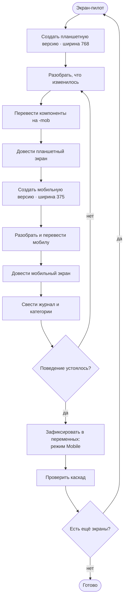
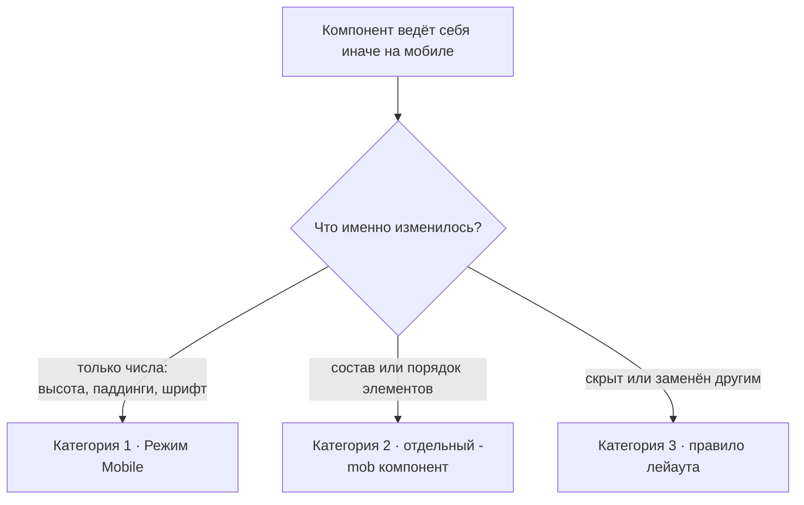
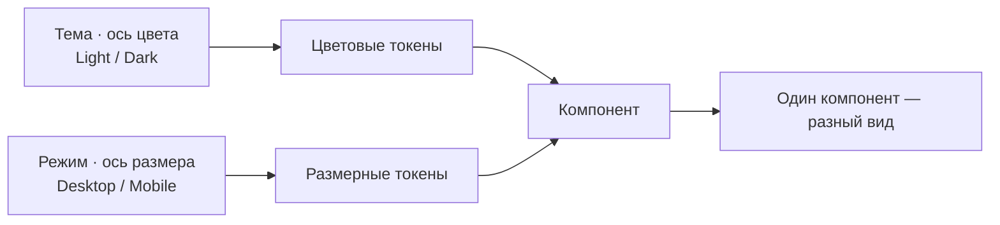
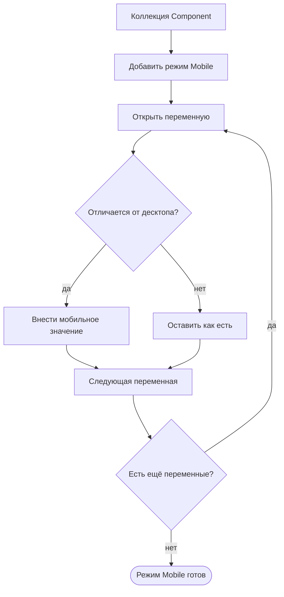
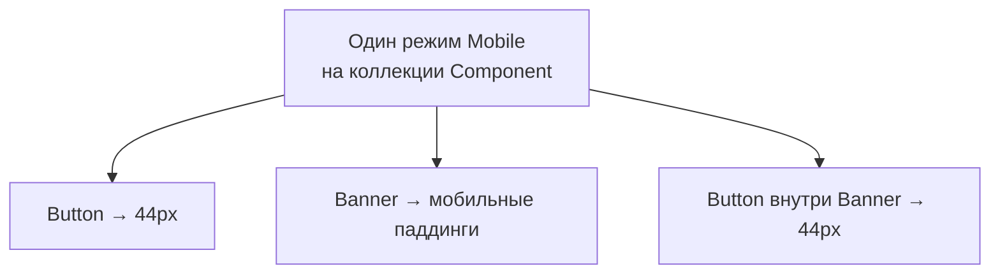
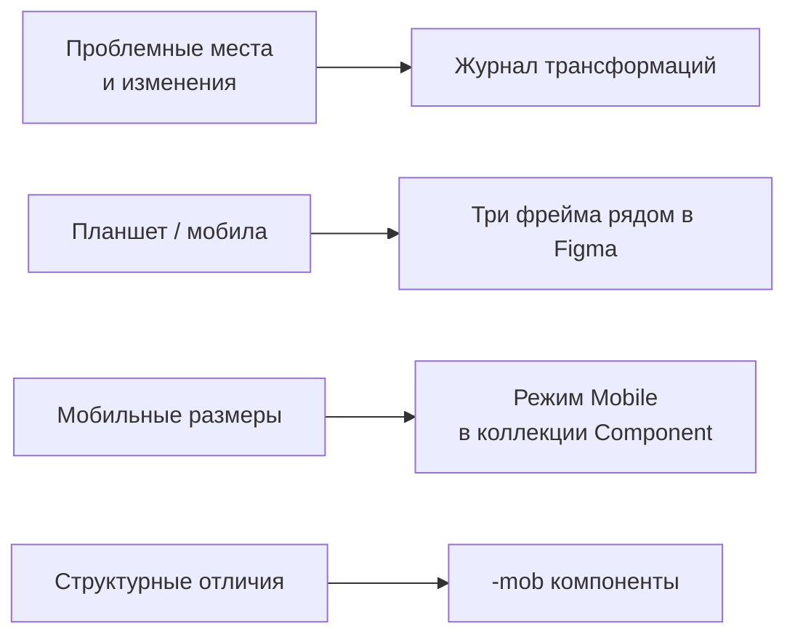

# Блок-схемы: перевод макетов iiko в планшет и мобилу

> Наглядные схемы процесса. Повторяется для каждого экрана, начиная с раздела «Склад».

---

## 1. Главная схема процесса

---

## 2. Решение по каждому компоненту

---

## 3. Две независимые оси

---

## 4. Фиксация в переменных

---

## 5. Каскад вложенных компонентов

---

## 6. Куда что писать

