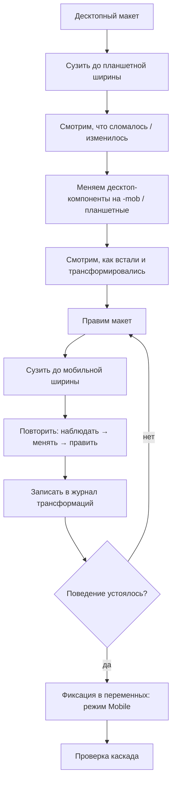

# Регламент: перевод макетов iiko в планшетную и мобильную версии

> Процесс для дизайнеров. Пилот — раздел «Склад», далее масштабирование на остальные разделы.

---

## 1. Зачем и главная идея

- В iiko **много разделов и приложений**, у каждого свои экраны и интерфейсы. Значит, **каждый десктоп уникален** — и мобильные версии тоже будут разными.
- **Общее у всех — дизайн-система** (компоненты и токены). Поэтому работаем не «перерисовкой экранов», а через ДС: понять, как ведёт себя компонент, и зафиксировать это в переменных один раз — дальше переиспользуем.
- Итог цикла: **пилотный экран** → **карта поведения компонентов** → **формализация в режиме `Mobile`** → ускорение всех следующих разделов.

## 2. Принципы

1. **От компонентов, не от пикселей.** Сначала понять, как трансформируется компонент, потом верстать экран.
2. **Порядок ширин:** Desktop → Tablet → Mobile (планшет — промежуточный шаг, помогает увидеть трансформацию).
3. **Ничего не хардкодить.** Любое изменение размера — через токены/режимы, не вручную по месту.
4. **Сначала эксперимент, потом фиксация.** Не заводим переменные, пока поведение не устоялось.
5. **Размер ≠ структура.** Разные типы изменений — разная судьба (см. [Часть B](#часть-b--классификация-компонентов)).

## 3. Термины

| Термин | Значение |
|---|---|
| **Режим (Mode)** | Набор значений переменных для платформы (`Desktop` / `Mobile`). |
| **Desktop / Tablet / Mobile** | Целевые ширины макета. |
| **`-mob`-компонент** | Отдельный компонент для **структурных** отличий. |
| **Журнал трансформаций** | Таблица «компонент → что изменилось». |
| **Карта поведения** | Накопленный журнал по всем экранам и разделам. |

## 4. Общий цикл (на один экран)

---

## Часть A. Пилот: один экран раздела «Склад»

### Шаг 0. Выбрать экран-пилота

- Берём **один** репрезентативный десктопный экран — желательно с максимумом типов компонентов: навигация, шапка, форма, таблица, кнопки, футер.
- Цель пилота — **не идеальный макет**, а **карта поведения компонентов**.

### Шаг 1. Разобрать десктоп

- Зафиксировать состав: какие компоненты ДС использованы.
- Разметить зоны: навигация, шапка, контент, футер.
- Выписать список компонентов в журнал — по нему будем идти дальше.

### Шаг 2. Планшетная итерация (ширина 768)

- Сузить фрейм до планшетной ширины.
- Посмотреть, **что «ломается» первым**: что не влезает, что переносится, что сжимается.
- Для сломанных мест — заменить десктоп-компоненты на `-mob`/планшетные, посмотреть, **как встали**.
- Править макет до аккуратного вида.
- Записать: **компонент → как изменился** (только размер / структура / скрыт).

### Шаг 3. Мобильная итерация (ширина ~360–430)

- Ещё сузить до мобильной ширины.
- Повторить тот же цикл: **наблюдать → менять компоненты → править макет**.
- Особое внимание:
  - навигация: сайдбар → бургер / нижняя навигация;
  - шапка и мультиколоночные блоки → одна колонка;
  - действия → вниз / в липкий футер;
  - тач-таргеты **≥ 44px**.
- Записать в журнал.

### Шаг 4. Заполнить журнал трансформаций

Форма таблицы:

| Компонент | Desktop | Tablet | Mobile | Что изменилось | Категория |
|---|---|---|---|---|---|
| Button M | 36px | 36px | **44px** | только размер (паддинги/высота) | только значения |
| Stepper | горизонт. | горизонт. | **свёрнут** | структура | структура |
| Sidenav | колонка | свёрнут | **бургер** | скрыт/заменён | скрыт/заменён |

### Шаг 5. Классифицировать и решить по каждому компоненту

- **Только значения** → пойдёт в **режим `Mobile`**.
- **Структура** → остаётся **`-mob`-компонентом**.
- **Скрыт / заменён** → правило навигации/лейаута (не компонент).

### Шаг 6. Зафиксировать в переменных (когда паттерн устоялся)

> Критерий готовности: компонент ведёт себя **одинаково на нескольких экранах**, а не на одном.

- Открыть коллекцию **`Component`** → добавить режим **`Mobile`**.
- Внести мобильные значения **только там, где отличается** от десктопа.
- Совпадающие значения **не трогать** (держать алласами на один примитив).
- **Цвет / радиус / тень не трогать** — они общие для платформ.

### Шаг 7. Проверить каскад

- Переключить режим коллекции → обновляются **все** компоненты и **вложенные инстансы** (например, кнопка внутри баннера).
- Сверить результат с журналом.

---

## Часть B. Классификация компонентов

| Категория | Признак | Что делать | Пример |
|---|---|---|---|
| **1. Только значения** | тот же набор свойств, цвет, радиус, состояния; отличаются только числа | → **режим `Mobile`** | Button, Input, Toggle, Banner |
| **2. Структура** | меняется состав/порядок элементов, раскладка внутри | → **отдельный `-mob`-компонент** | Stepper, сложная карточка, навигация |
| **3. Скрыт / заменён** | элемент уходит или заменяется другим | → **правило лейаута** (не компонент) | Sidenav → бургер, десктоп-табы → нижняя панель |

**Правило-ориентир:**
> Одинаковый набор свойств/цвет/радиус/состояния, отличаются только числа → Категория 1 (режим).
> Меняется состав или порядок → Категория 2 (отдельный компонент).

---

## Часть C. Масштабирование на остальные разделы

1. Закончить пилотный экран «Склада» (Часть A).
2. Повторить цикл на **остальных экранах раздела «Склад»**.
3. Перейти к **другим разделам** — тем же циклом.
4. Каждый новый экран **сверяем с картой поведения**: если поведение компонента уже известно — не исследуем заново, просто применяем. Новое — дописываем в карту.
5. Со временем карта растёт → ручной работы всё меньше, а мобильные версии становятся предсказуемыми.

---

## Часть D. Артефакты (что на выходе)

- [ ] Планшетные и мобильные фреймы экрана.
- [ ] **Журнал трансформаций** по форме из Шага 4.
- [ ] Обновлённая **карта поведения** компонентов.
- [ ] Обновлённые **переменные** (режим `Mobile` в коллекции `Component`).
- [ ] **`-mob`-компоненты** — только для структурных отличий.
- [ ] (В коде) `modes.css` / `themes.css` + соглашение в `iiko-ds-spec.md`.

---

## Часть E. Что показывать другим дизайнерам

- **Пилотный экран**: десктоп / планшет / мобила рядом — наглядно, как всё перестроилось.
- **Журнал трансформаций**: таблица «компонент → что изменилось → категория».
- **Карту поведения**: какие компоненты решают как и почему.
- **Правило выбора**: когда режим, когда `-mob`, когда правило лейаута.

---

## Часть F. Технические оговорки (чтобы не наступить на грабли)

- Режим **создаётся у коллекции переменных**, не у компонента.
- Новый режим **копирует значения** дефолтного — меняем только отличия.
- Совпадающие значения **не стирать** — у переменной всегда есть значение в каждом режиме.
- **Все размерные переменные — в одной коллекции** (`Component`), иначе каскад вложенных инстансов не сработает.
- Режим **глобальный на файл**: оба варианта рядом переключением режима не показать → для показа рядом нужен **per-instance override**.
- **Планшет и телефон** используют **один мобильный набор компонентов**, отличается только компоновка (брейкпоинты внутри мобильного диапазона).
- Дефолтный режим = **Desktop** (старые прототипы остаются как есть).
